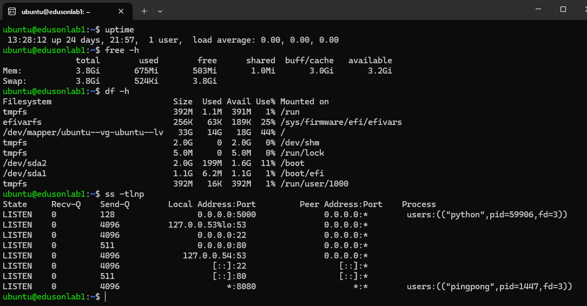
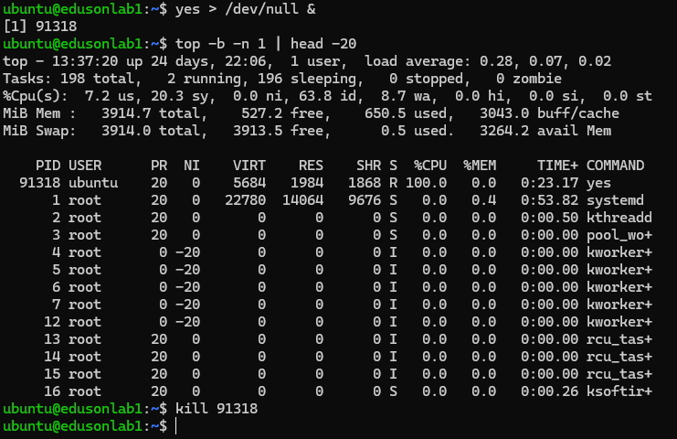
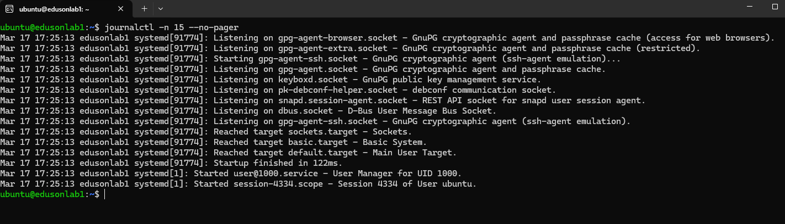
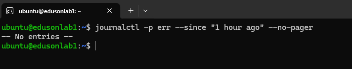
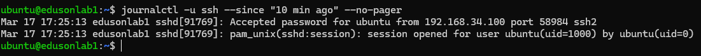
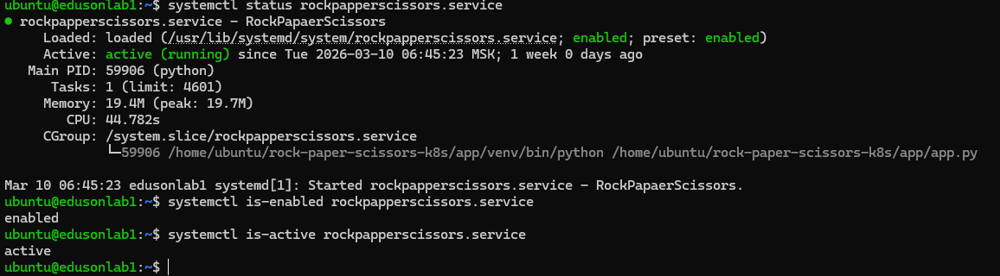
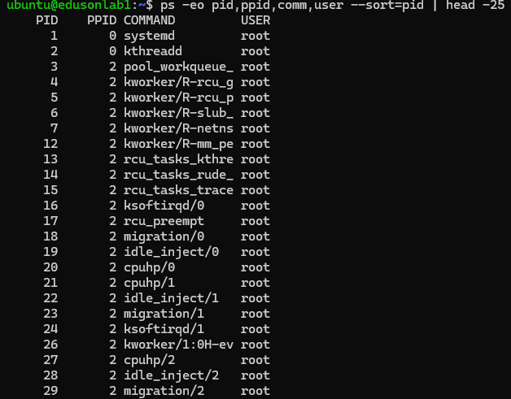
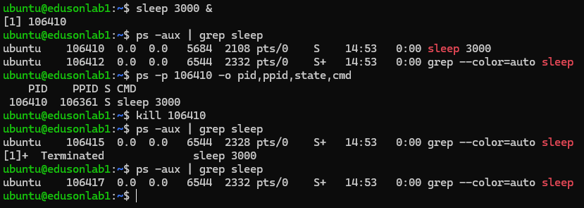

### 1. Мониторинг ресурсов и диагностика «проблемы»
1. **Снимок «нормального» состояния.** Выполните и сохраните вывод команд: `uptime`, `free -h`, `df -h`, `ss -tlnp` (или `netstat -tlnp`).

- `uptime`: Показывает как долго система запущена, а также нагруженность системы за 1, 5 и 15 минут (Число не должно превышать колличества CPU сервера)
- `free -h`: Показывает колличество свободной и использованной памяти в системе. При нехватке памяти и медленном отклике системы, так как может использоваться swap.
- `df -h`: Показывает использование пространства файловой системы (Обращать внимание на процент свободного места, особенно в корневой точке монтирования)
- `ss -tlnp`: Утилита для отображения состояния портов(сокетов). Показываеn, что находится на определенном порте, если он занят.
2. **Симуляция нагрузки.**

Запущенный ранее процесс (`yes > /dev/null &`) с `PID 91318` занимал 100% ресурсов CPU.

3. **Итог.** 
С помощью `uptime` проверить во-первых сколько включен сервер, далее проврить load average (Если первое значение высокое, чем следующие, то какой-то процесс стал грузить систему. Если же первое значение низкое, а второе и третье высокое - скорее всего процесс закрылся с OOM killer`ом).

Чтобы определить какой процесс виноват стоить использовать `top` или `htop`, а внутри данных утилит сделать сортировку по использованию CPU и MEMORY, и если закрыть их с помощью PID и команды `kill $PID_ID` в терминале или же закрыть внутри ранее упомянутых утилит.

### 2. Логи и journalctl
1. 
Вывод состит из следующего:
`Дата+время события`---`Имя хоста, на котором произошло событие`---`Источник события`---`Текст события`
2. 
Ошибок нет.
Выводит ошибки, которые возникли в течение последнего часа в системе.
3. 
Так как лог разрастается быстро, то для того чтобы быстро сориентироваться во всех записях, удобнее искать именно по имени сервиса. Так же помогает не упустить нужную строчку с важной информацией.

### 3. systemd: управление сервисом и свой unit
1. **Управление существующим сервисом.** 

- `systemctl status rockpapperscissors.service`: active - сервис запущен и работает в данный момент, enabled - юнит будет запущен автоматически после загрузки системы.
- `systemctl is-enabled <имя>` - включен ли автозапуск
- `systemctl is-active <имя>` - запущен ли юнит в данный момент

### 4. Процессы: просмотр и управление
1. 

- PID: Индитификатор запущенного процесса
- PPID: Индитификатор родительского процесса
Так например процесс с PID=17 (rcu_preempt), является дочерним процессом для PID=2 (kthreadd).
2.

- State: `sleep` - находится в прерываемом спящем состоянии, где процесс реагирует на сигналы и доступность ресурсов.
3.
- Процесс - это экземпляр программы, под которую выделены системные ресурсы. Каждый процесс выполняется в отдельном адресном пространстве.
- Поток - это способ выполнения процесса, определяющий последовательность исполнения кода в процессе.
`ps` - удобно, когда надо увидеть как ведет процесс себя в данную секунду(формат "скриншота"), чтобы увидеть его реальную нагрузку.
`top` - удобно, если необходимо в онлайн режиме следить как процесс нагружает систему.
``
