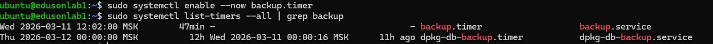
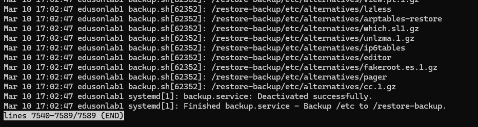

## Для продвинутых
### 1. Автоматизация через systemd timer
1. Создайте `backup.service` и `backup.timer` для ежедневного запуска backup-скрипта.
2. Включите таймер (`enable --now`) и проверьте его состояние.
3. Сделайте ручной запуск `backup.service` и приложите вывод `journalctl -u backup.service`.
4. Добавьте `Persistent=true` и поясните, зачем это нужно.

### 2. Вариант с ротацией backup-файлов
Реализуйте одно из решений:
- ротация старых архивов shell-скриптом (хранить только последние N файлов);
- либо отдельная настройка `logrotate` для логов backup-скрипта.
Покажите конфиг/скрипт и результат проверки.
### 3. Runbook восстановления
Сделайте короткий runbook (чек-лист на 10-15 шагов):
1. Как определить объем инцидента.
2. Какие сервисы остановить перед restore.
3. Какой backup выбирать.
4. Как проверить целостность.
5. Как выполнить restore и пост-проверки.
6. Какие команды смотреть в логах после запуска сервиса.
### 4. Опционально: Bacula (для желающих)
1. Опишите роли `Director`, `Storage Daemon`, `File Daemon`.
2. Нарисуйте схему из двух хостов: `backup-srv` и `app-01`.
3. Приведите пример задания `Job` (ежедневный incremental + еженедельный full).
4. Опишите шаги проверки restore одного файла.

### Ответ
### №1
1. Units: `backup.service` и `backup.timer` 
```console
[Unit]
Description=Backup /etc to /restore-backup
After=network.target
[Service]
Type=oneshot
User=root
ExecStart=/home/ubuntu/backup.sh
ExecStopPost=/bin/sh -c 'echo "[$(date)] Backup completed" >> /var/log/backup.log'
```

```console
[Unit]
Description=Run backup.service daily at 12:02
[Timer]
OnCalendar=*-*-* 12:02:00
Persistent=true
[Install]
WantedBy=timers.target
```

2. Включение таймера и проверка состояния.


3. Запуск вручную и конец вывода скрипта:


4. Persistent=true - Запускает задачу после включения сервера, если в указанное время бекапирования сервер был выключен

### №2
1. Скрипт с ротацией архивов старше 7 дней и быстрой доступностью последней копии:
```console
#!/bin/bash
/usr/bin/rsync -av --delete /etc /restore-backup/
tar -czvf /restore-backup/etc-$(date +%Y%m%d-%H%M%S).tar.gz /restore-backup/etc
find /restore-backup/etc-* -mtime +7 -exec rm {} \;
```

### №3
1. Посчитать показатели RTO и RPO, для этого определиться с вопросами:
- Какой объем потерянных данных организация может себе позволить?
- Насколько критична система, которая будет архивироваться?
- С какой частотой будет производиться резервное копирование данных?
2. Перед восстановлением необходимо остановить те службы, которые архивировались и будут восстановленные (Mysql, Postgres, Nginx ...)
3. Определиться с типом Backup:
- Full backup - полная копия всех данных на момент выполнения резервного копирования. При восстановлении не требуется дополнительных данных — достаточно одной полной копии. Преимущества: простота восстановления, независимость от других бэкапов. Недостатки: занимает много места, дольше выполняется по времени.
- Incremental backup - сохраняет только те данные, которые изменились с момента последнего бэкапа — будь то полный или предыдущий инкрементальный. Преимущества: быстрый процесс копирования, экономия места на диске. Недостатки: для восстановления нужны все предыдущие бэкапы, включая полный, восстановление занимает больше времени.
- Differential backup - сохраняет все изменения с момента последнего полного бэкапа. Преимущества: быстрее восстанавливаются, чем инкрементальные, не требуют цепочки бэкапов — только полный и последний дифференциальный. Недостатки: размер копии увеличивается с каждым днём, со временем процесс становится медленнее.
4. Проверить целостность backup, для этого:
- Физическая целостность (файл не повреждён, архив открывается, база читается).
- Логическая целостность (данные внутри не повреждены: таблицы базы не битые, структура совпадает).
- Восстановимость (можно развернуть сайт/сервис из бэкапа и он реально работает).
Проверить можно с помощью:
- Проверка контрольных сумм (md5, sha256 и т.д.)
- Проверка архивов (tar, zip, rar и др.)
- Проверка дампов баз данных (MySQL, PostgreSQL, SQLite)
- Автоматизированные проверки и тестовые восстановления (Например скрипт, с разворотом в тестовой среде, с ответом об успехе/не успехе разворачивания бекапа)

5. Как выполнить restore и пост-проверки.
- Подготовка: Выберать изолированную среду (песочницу), чтобы не нарушить работу продакшена.
- Восстановление: Запустить процедуру восстановления из выбранной контрольной точки в системе управления бэкапами
- Тестирование:
    1) Heartbeat: Проверка, загрузилась ли ОС.
    2) Приложения: Проверка работы сервисов (БД, веб-сервер).
    3) Скрипты: Запуск проверочных скриптов для подтверждения целостности данных.
- Проверка целостности: Убедиться, что данные актуальны и не повреждены
- Отчет: Задокументируйте успешное восстановление или ошибки (если есть).
6. Какие команды смотреть в логах после запуска сервиса.
Основные это:
- Windows (Системный бэкап): Нажмите Win + R, введите eventvwr.msc -> «Журналы Windows» -> «Приложение» или «Система» для поиска ошибок восстановления.
- Специализированное ПО (напр., Veeam): Логи обычно находятся в %ProgramData%/Veeam/Endpoint (или Backup/Endpoint) для Windows или /var/log/veeam для Linux.
- Корпоративные системы (напр., Druva): Вкладка «Резервное копирование и восстановление» -> «Подробности» (под статусом) -> «Журналы».
- Облачные сервисы (Android): «Настройки» -> «Сервисы Google» -> «Резервное копирование» -> «Сведения о резервном копировании».
- Базы данных (SQL Server): Ищите логи «tail-log» (заключительный фрагмент журнала) для подтверждения корректности восстановления.

Что искать в логах:
- Коды ошибок (Error, Warning).
- Время начала и окончания процесса.
- Сообщение «Restore completed successfully» (или аналогичное).

### 4. Опционально: Bacula (для желающих)
PS. Заглушка (Если успею сделать, добавлю)