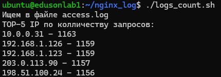
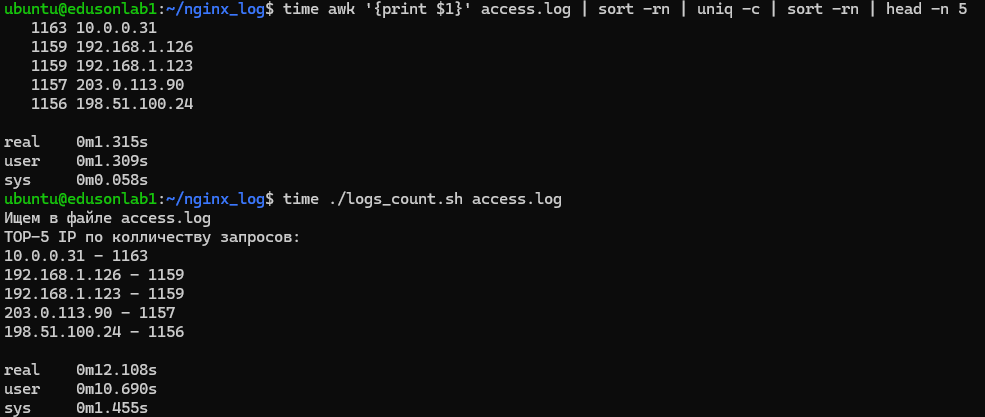

### 1. Скрипт на BASH, который принимает путь к `access.log` и выводит топ-5 IP по числу запросов.

```console
#!/bin/bash
#
#
# Задаём переменные
file=${1:-"access.log"}
regex="access.log"

# Проверка на валидность указанного файла
if [ -f $file ] && [[ $file =~ $regex ]]; then
        echo "Ищем в файле $file"
else
        echo "Указан неверный файл"
        exit
fi


# Задаем ассоциативный массив
declare -A count


# Считываем файл и заносим в массив колличество найденных IP-адрессов
readarray rows < $file

for row in "${rows[@]}";do
  row_array=(${row})
  first_column=${row_array[0]}
  (( count[$first_column]++))
done

# Вывод с необходимым форматированием
echo "TOP-5 IP по колличеству запросов:"
for IP in "${!count[@]}"; do
        echo "${IP}" - "${count[$IP]}"
done | sort -rn -k3 | head -n 5
```



- По времени скрипт выполнеяется дольше, чем awk, так как просиходит несколько проходов по массивам данных, что занимает больше ресурсов.
