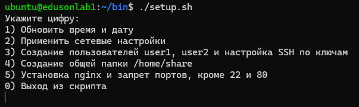

### Ответ
1. Обновленный скрипт

Был реализовано поэтапное обновление ПК, при помощи интуитивного выбора с помощью ввода цифры с клавиатуры, реализованного с помощью циклов whild и case. Добавлена возможность указать город, с которым необходимо синхронизировать время и дату, если такое требуется. А также, с помощью цикла for и создания массива пользователей уменьшенно колличество повторяющихся строк кода и упрощенна возможность добавления новых пользователей, путём редактирования самого массива данных.



```console
#!/bin/bash

while :
do

read -p "$(echo -e 'Укажите цифру: \n1) Обновить время и дату \n2) Применить сетевые настройки \n3) Создание пользователей user1, user2 и настройка SSH по ключам\n4) Создание общей папки /home/share\n5) Установка nginx и запрет портов, кроме 22 и 80\n0) Выход из скрипта\n\b')" number

case $number in

  1 )
# Поиск и установка зоны

read -p "$(echo -e 'Введите город в нужной часовой зоне на латинице (default: Moscow)\n\b')" city
checktimezone=${city:-"Moscow"}
timezone="$(timedatectl list-timezones | grep $checktimezone)"
echo $timezone

if [ -z "$timezone" ]; then
        echo -e "\nНеверно указан город. Обновление времени не выполнено. Повторите запрос\n"
        continue
fi

sudo timedatectl set-timezone $timezone
echo ""
# Установка ntp и добавление pool серверов
sudo apt update && sudo apt upgrade -y #Обновление системы
sudo apt install ntp -y #Установка ntp демона
sudo sed -e '/pool 2.ubuntu.pool.ntp.org iburst/s/^#*/#/g' -i /etc/ntpsec/ntp.conf # Комментирование лишних дефолтных пулов времени
sudo sed -e '/pool 3.ubuntu.pool.ntp.org iburst/s/^#*/#/g' -i /etc/ntpsec/ntp.conf
ntpq -p # Проверка синхронизации и и вывод времени
date
echo -e "\nВремя и дата обновлены успешно.\n" ;;

  2 )
# Копирование сетевого файла netplan(dhcp сеть) и применение настроек
sudo cp /home/ubuntu/bin/00-installer-config.yaml /etc/netplan/
sudo netplan apply
echo -e "\nНастройки сети применились успешно.\n" ;;

  3 )

userArray=(user1 user2)
for users in ${userArray[@]}; do
        echo -e "Настрока пользователя $users:\n"
# Создание пользователей
sudo useradd -m -s /bin/bash $users

# Создание ключей по пути /home/ubuntu/*.pub
ssh-keygen -t ed25519 -C "$users" -q -N '' -f ~/$users <<< $'\nn'

# Даём доступ ssh пользователя
sudo cp -r /home/ubuntu/.ssh /home/$users/
sudo chown -R $users:$users /home/$users/.ssh

USER_PUBKEY=$( cat /home/ubuntu/$users.pub ) # Задаем переменные со значением публичных ключей, чтобы проверить нет ли их уже с дальнейшим добавлением в /home/ubuntu/.ssh/authorized_keys

AUTH_FILE="/home/$users/.ssh/authorized_keys"

### Добавление в файл с проверкой уже наличия публичного ключа в базе
if sudo grep -q "$USER_PUBKEY" "$AUTH_FILE"
then
        echo "Доступ есть. Публичный ключ уже в базе."
else
        echo $USER_PUBKEY | sudo tee -a $AUTH_FILE
fi

done


#Даем доступ группе user1 - 'apt update', а пользователю user2 использовать 'systemctl status' без пароля
USER1_update="%user1 ALL=(ALL) NOPASSWD: /usr/bin/apt update"
USER2_status="user2 ALL=(ALL) NOPASSWD: /usr/bin/systemctl status *"
SUDOERS="/etc/sudoers"

sudo chmod +w /etc/sudoers

if sudo grep -q "$USER1_update" "$SUDOERS"
then
                echo "Строка уже добавлена."
        else
                        echo "$USER1_update" | sudo tee -a $SUDOERS
fi


if sudo grep -q "$USER2_status" "$SUDOERS"
then
                echo "Строка уже добавлена."
        else
                        echo "$USER2_status" | sudo tee -a $SUDOERS
fi

sudo chmod -w /etc/sudoers
sudo visudo -c

# Установка захода только по ключам
sudo truncate -s 0 /etc/ssh/sshd_config.d/50-cloud-init.conf # Очистка файла от всех записей
echo -e "PasswordAuthentication no\nPubkeyAuthentication yes" | sudo tee -a /etc/ssh/sshd_config.d/50-cloud-init.conf # Установка запретов
sudo systemctl restart ssh

echo -e "\nПользователи созданы и SSH настроен успешно\n" ;;


  4 )
# Создаем папку и даем права наследования
sudo mkdir /home/share
sudo chmod -R g+s /home/share
sudo chmod 777 /home/share
cd /home/share
mkdir my_folder
chmod 700 /home/share/my_folder
echo -e "\nПапка создана успешно.\n" ;;

  5 )
# Настройка доступа к портам и проверка правил + nginx
sudo apt install ufw -y
sudo ufw allow 22/tcp
sudo ufw allow 80/tcp
sudo ufw default deny incoming
sudo ufw default allow outgoing
yes | sudo ufw enable
sudo ufw status verbose
sudo apt install nginx -y
echo -e "\nNginx установлен, порты закрыты.(Кроме 80 и 22)\n" ;;


  0 ) echo -e "\nВыход...\nВсего наилучшего, ${USER}!\n" ; exit ;;

  * ) echo -e "${USER}, введите корректный запрос!!!\n" ; continue ;;
esac
done
```
