# Домашняя работа: разделы 6 (Web-серверы) и 7 (TLS/HTTPS)
**Сдача (рекомендуемый формат):** один документ (Markdown), скриншотами/логами по запросу и
**текстом конфигов** (без закрытых ключей в открытом виде — ключи в отчёт не класть; достаточно путей
и прав `chmod`).
---
## HTTP: nginx и статический сайт

1. Установлен **nginx**, добавлен сайт типа **`hw-nikolaev.local`**, добавлен **`index.html`**.
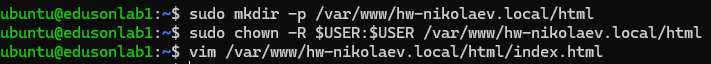

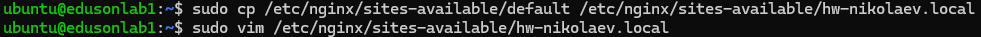

**`"/etc/nginx/sites-available/hw-nikolaev.local"`**
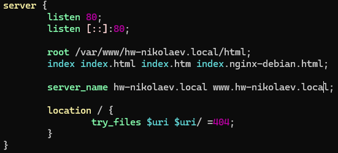

**`"/var/www/hw-nikolaev.local/html/index.html"`**
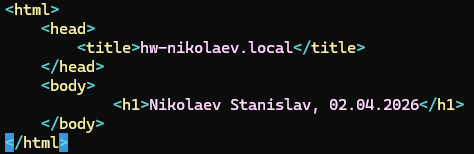

**подключение сайта и проверка конфигурации на правильность**
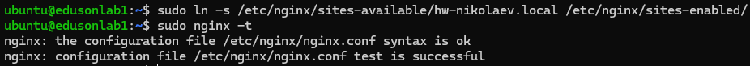

4. Смена **`hosts`**
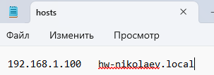

5. Проверка: `curl -v http://hw-nikolaev.local/` без проксирования.
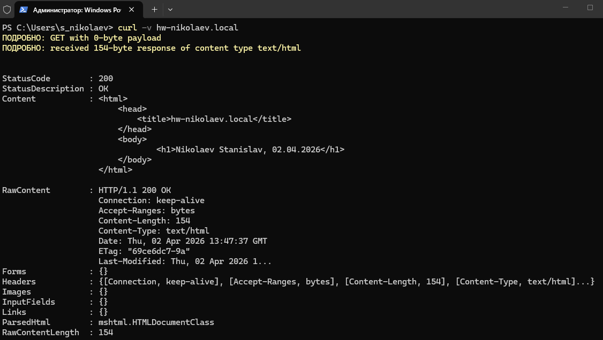
6. Конфигурационный файл и проверка: `curl -v http://hw-nikolaev.local/` с проксированием:
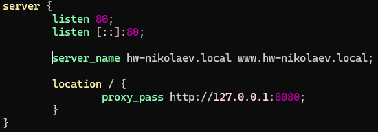
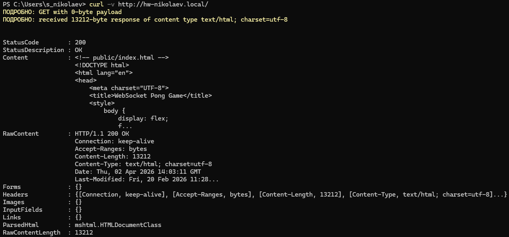

---
## OpenSSL: просмотр «чужого» и своего сертификата
1. **Подключение к `google.com:443` и просмотр сохранённого сертификата**
```console
openssl s_client -showcerts -connect google.com:443 </dev/null
openssl x509 -in google.com\:443.crt -text -noout
```
- **`subject`:**
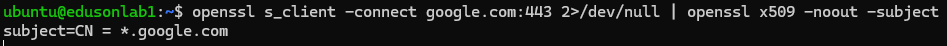
- **`**issuer`:**
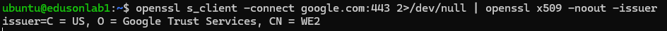
- **даты `notBefore` / `notAfter`:**
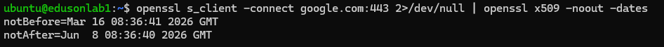

2. **`-servername`**:
Это параметр позволяет клиенту указывать имя домена, с которым он пытается связаться, во время handshake TLS.

3. *(По желанию)* Сохраните **первый** PEM-блок сертификата в файл и покажите фрагмент `openssl
x509 -in ... -text -noout` с секцией **Subject Alternative Name** (или отметьте, что SAN нет, если так вышло).
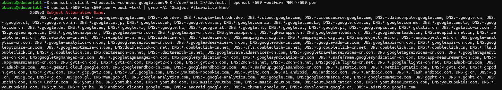

---
## HTTPS на nginx
Выполните **один** из вариантов (пометьте в отчёте, какой выбрали).
### Вариант 1 — свой корневой CA и сертификат сайта (рекомендуется для домашней сети)
1. Выпустите **корневой** `root.crt` / `root.key` и **серверный** сертификат с **SAN** на ваше имя хоста.
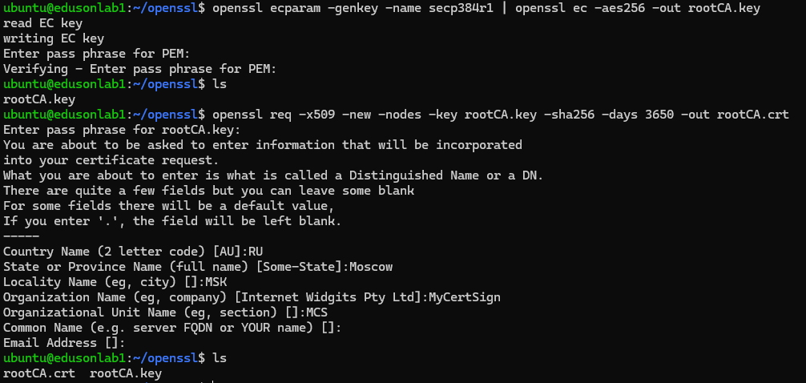
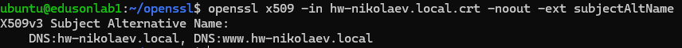
2. Подключите **`ssl_certificate`** и **`ssl_certificate_key`** в nginx; редирект **HTTP → HTTPS** (как в
лабе).
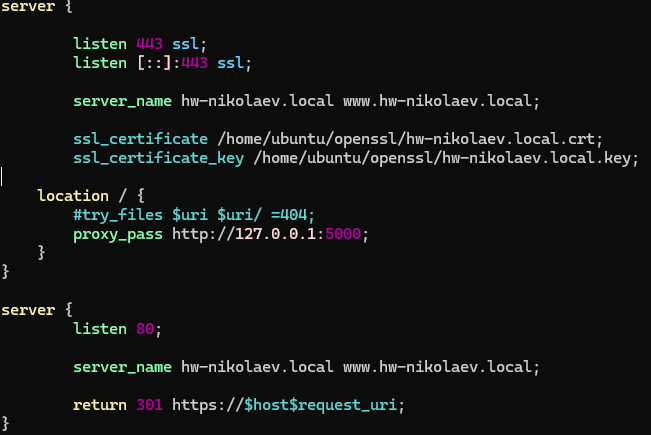
3. Добавьте **`root.crt`** в доверенные **на клиенте** (Linux: `update-ca-certificates` / `update-ca-trust` /
`trust` ).
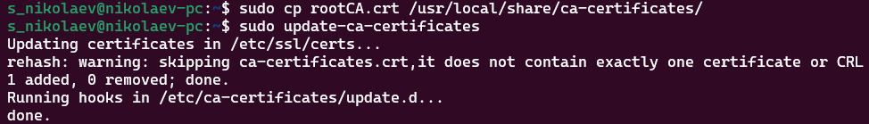
4. В отчёт: `curl -v https://hw-<логин>.local/` **без** `-k` с успешной проверкой; отдельно — вывод `openssl
s_client -connect ... -CAfile root.crt` (достаточно строк про `Verify return code` и цепочку).
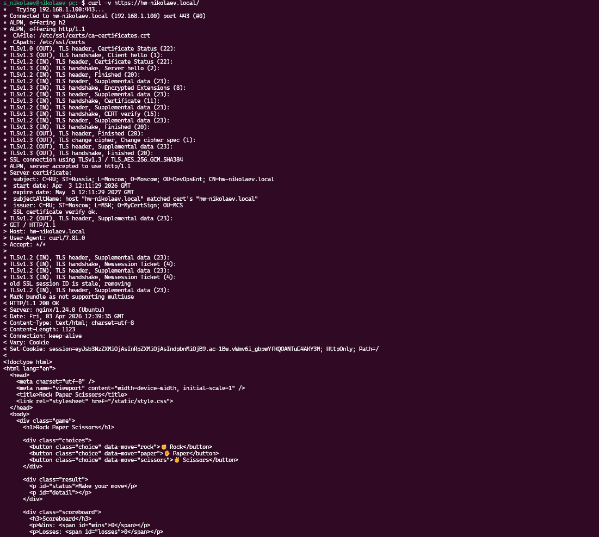
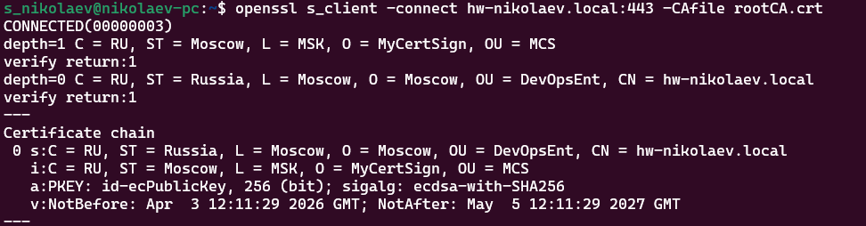