### Ответ

1. Скрин с результатами playbook`а и сам playbook:
```console
---
- name: Базовая настройка сервера Ubuntu 24.04
  hosts: all
  vars:
    db_name: books_DB
    db_user: hw_nikolaev
    db_password: 123456
  become: true
  tasks:
    - name: Обновление пакетов apt
      ansible.builtin.apt:
        update_cache: yes

    - name: Установка PostgreSQL
      ansible.builtin.apt:
        name: postgresql
        state: present

    - name: Показать data_direcory
      shell: sudo -u postgres psql -c "SHOW data_directory;"
      register: result_data_directory

    - name: Отобразить переменную result_data_directory
      debug:
        var: result_data_directory.stdout_lines

    - name: Создание роли в DB
      community.postgresql.postgresql_user:
        name: "{{ db_user }}"
        password: "{{ db_password }}"
        role_attr_flags: LOGIN
        state: present
        login_user: postgres

    - name: Создание DB
      community.general.postgresql_db:
        name: "{{ db_name }}"
        owner: "{{ db_user }}"
        encoding: UTF-8
        lc_collate: en_US.UTF-8
        lc_ctype: en_US.UTF-8
        state: present
```
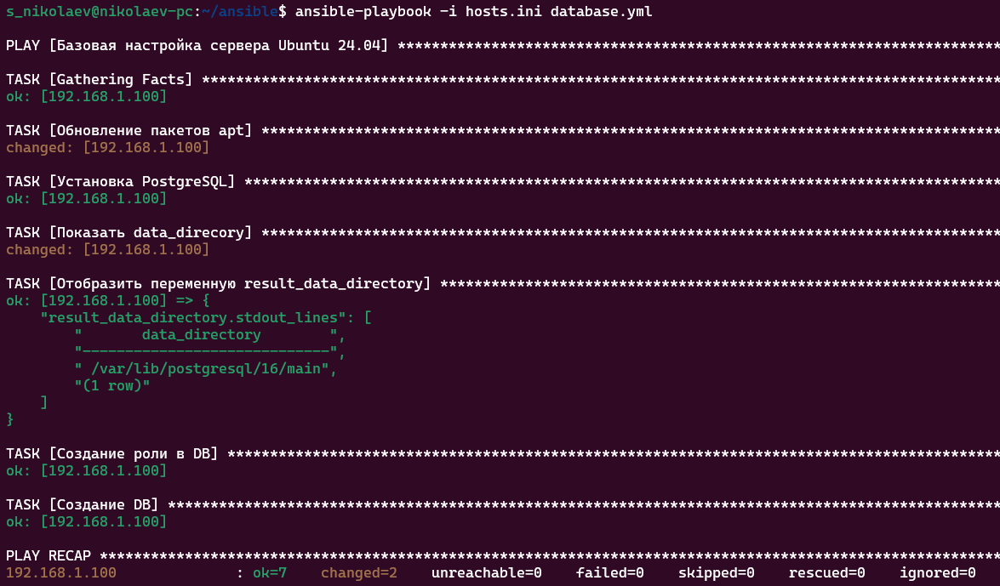

2. Подключение к базе с хоста:
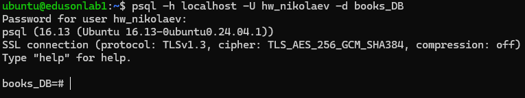

---
1. Создание таблицы:
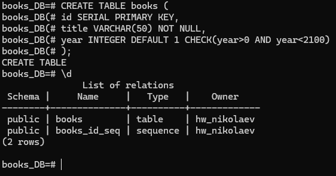
Выполните и приложите в отчёт:
1. **`INSERT`** — не менее **3** книг.
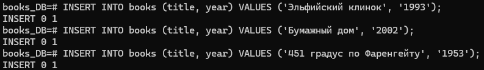
2. **`SELECT`** — все книги, отсортированные по году **по убыванию**.
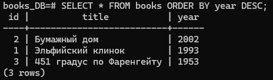
3. **`SELECT`** с **`WHERE`** — только книги после заданного года (год выберите сами).
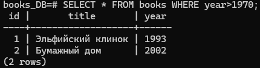
4. Скрин или текст вывода **`\d books`**.
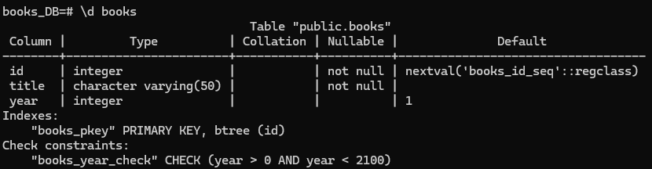


---
1. Выполните **`\l`** (или `SELECT datname FROM pg_database ORDER BY 1;`) и **своими
словами** опишите назначение баз **`postgres`**, **`template1`**, **`template0`** (по
одному предложению на базу).
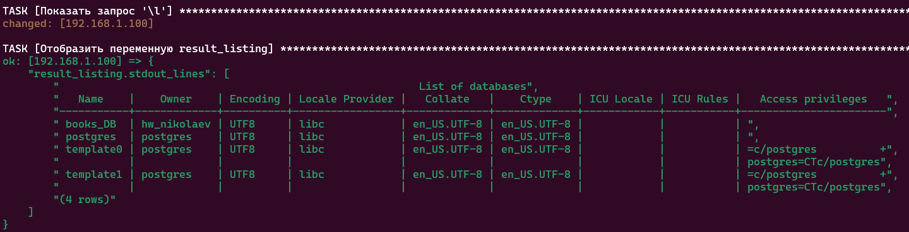
postgres - начальная база данных, к которой подключается пользователь postgres.
template1 - шаблонная база, по примеру которой создаются новые базы.
template0 - шаблонная база для template1, если она 'поломается'.
2. Выполните запрос к **`pg_stat_activity`** (можно взять пример из занятий в репозитории
или упростить до `SELECT pid, datname, usename, state FROM pg_stat_activity WHERE datname
IS NOT NULL;`). В отчёт приложите **результат** и поясните, **какая строка** соответствует
**вашему** текущему подключению **`psql`**.
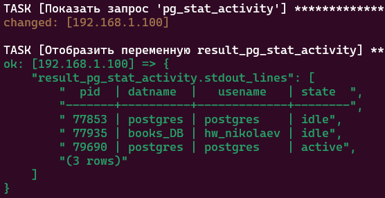
На скриншоте - это 3 строка в таблице, помеченная статусом 'active'.
3. *(По желанию)* Кратко (2–4 предложения): чем **`pg_catalog`** отличается от
**`information_schema`** и зачем администратору **`pg_stat_database`**.
`information_schema` - это представление информации о структуре БД, соответствующая спецификации SQL (структура может менять только при изменении стандарта).
`pg_catalog` - специфичен только для PostgreSQL, но содержит вообще всю информацию специфичные для PostgreSQL(information_schema может их не отображать)
`pg_stat_database` - необходима для мониторинга нагрузки, как общей так и отдельных баз данных, по отчетам которой можно найти проблемные(узкие) места.

Соберите лабораторию **primary + standby** По материалам занятия. В отчёт приложите:
1. Вывод **`SELECT pg_is_in_recovery();`**:
`Primary`:
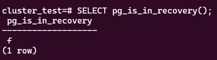

`Standby`:
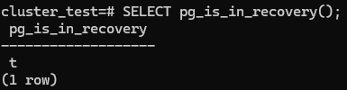
2. Фрагмент результата запроса к **`pg_stat_replication`** на **primary**:
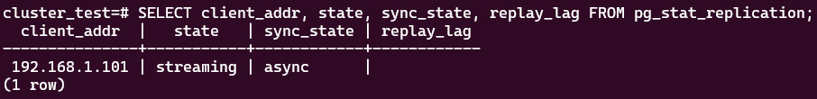
3. Подтверждение, что **тестовая таблица/строка**, созданные на primary, **видны на
replica** на чтение (`SELECT`).
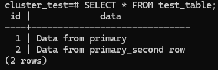
4. Поля **`active`** / **`slot_name`** в **`pg_replication_slots`** на primary.
`active` - поле, показывающее, используется ли для реплакации данный слот.
`slot_name` - имя, уникальный индитификатор для слота репликации

---
1. Приложите вывод **`pg_is_in_recovery()`** на бывшей replica **после** промоута.
2. Двумя предложениями опишите, **почему** в проде после такого эксперимента старый
primary нельзя просто «включить обратно» с тем же старым томом без процедуры
синхронизации.
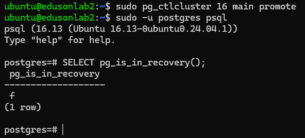

После мнговенного включения старого primary, оба сервера могут решить, что они оба имеют первичную роль(primary), что в итоге ведёт к потере данных. А также может нарушиться логическая репликация.

---
1. Настройте логический бэкап своей базы, сделайте скрипт и запустите его по таймауту
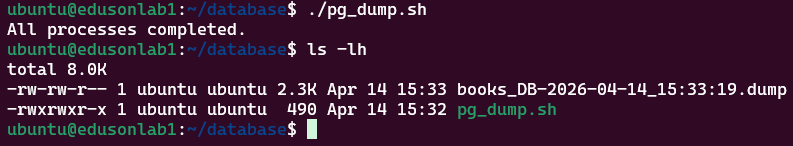

Сам скрипт:
```console
#!/bin/bash

export PGPASSWORD='123456'

run_with_timeout() {
  timeout 100s "$@" || echo "Process $1 timed out"
}

# Запуск нескольких процессов параллельно, для других БД, если необходимо
run_with_timeout pg_dump -U hw_nikolaev -w -h localhost books_DB > /home/ubuntu/database/books_DB-"`date +"%Y-%m-%d_%H:%M:%S"`".dump &

# Ожидаем завершения всех процессов
wait
echo "All processes completed."
```