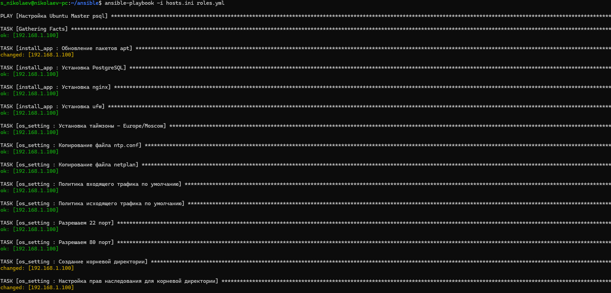
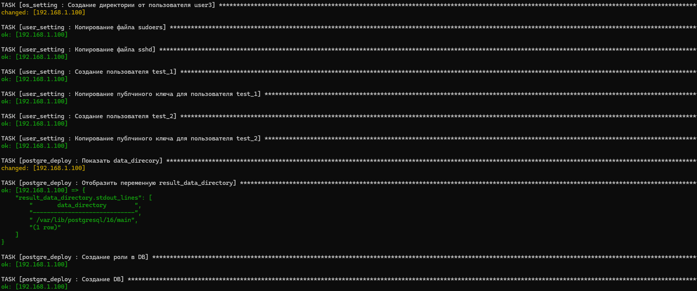
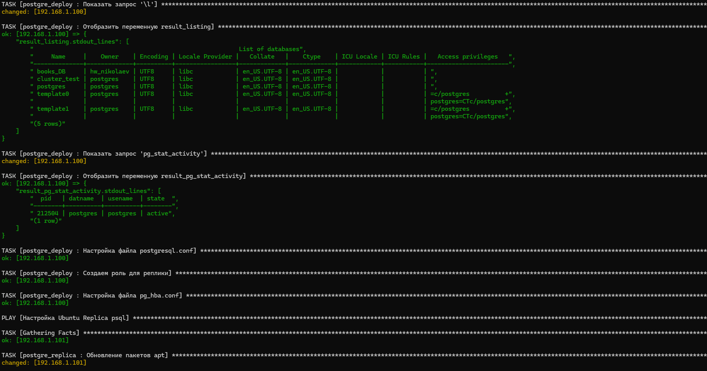
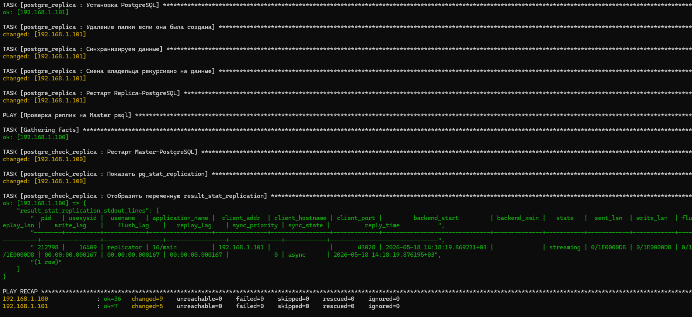
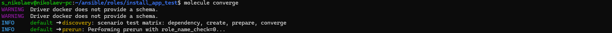
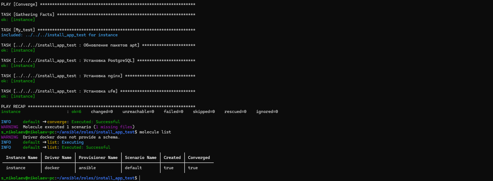

#### 1. Создайте роли для настройки по всем предыдущим занятиям, от настройки времени до установки и настройки системы управления базами данных (в том числе репликации). В чем разница запуска скрипта и роли.
- Результат в виде скриншотов + все ansible файлы из папки в гите

#### 2. Напишите тесты хотя бы к одной из ролей.
- Результат в виде скриншотов + все ansible файлы из папки в гите

