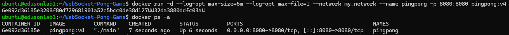
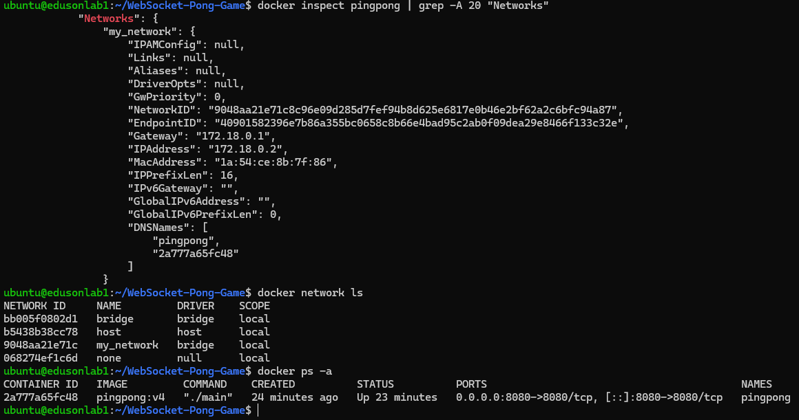
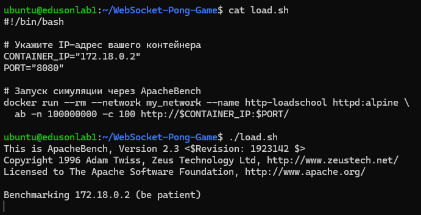
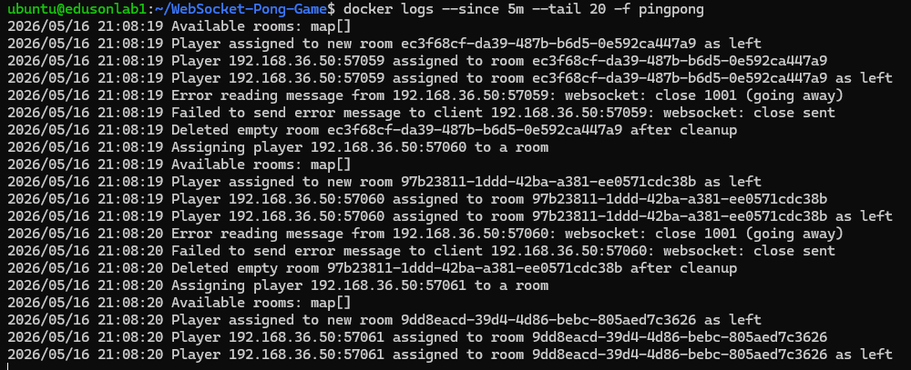
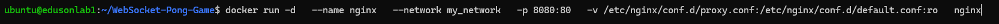
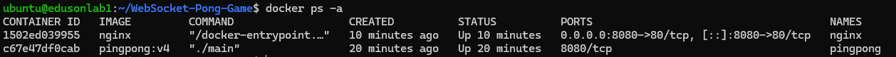
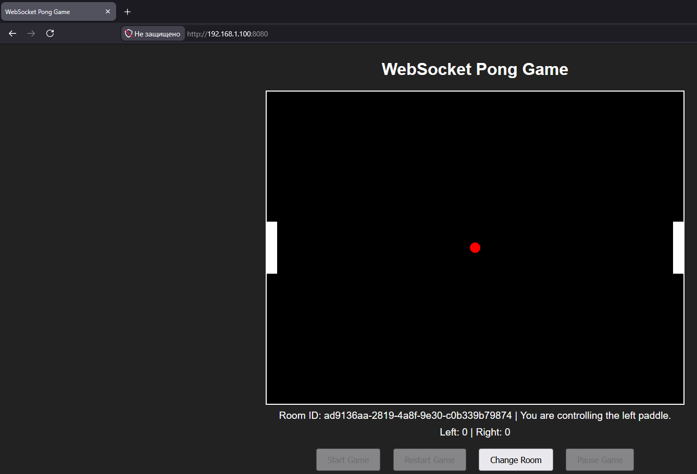
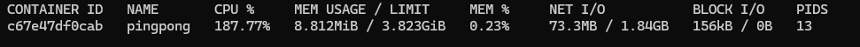

# 1. Создайте образ из Dockerfile для приложения для которого Вы делали systemd юнит файл.
```console
FROM golang:1.23-bookworm AS builder

WORKDIR /app

COPY go.mod ./

RUN go mod download

COPY . .

RUN go build -o main .

EXPOSE 8080

CMD ["./main"]
```

# 2. Запустите получившийся образ не в сети по умолчанию, сделайте новую сеть и в ней запустите контейнер, сделалайте проброс портов для того, что бы вы могли обращаться к контейнеру. Напишите скрипт для симуляции нагрузки на контейнер. Посмотрите логи контейнера в реальном времени выводите последние 20 строк и логи за последние 5 минут. Ограничьте хранение логов контейнера 5 мегабайтами и 1 файлом. Проверьте ротацию файлов.

### Создание контейнера с логами


### Проверка сети:


### Скрипт нагрузки подключений:


### Вывод логов:


# 3. Запустите контейнер с nginx пробросьте каталог с конфигурационными файлами для него. В конфигурационном файле настройте проксирование от nginx к Вашему приложению (необходимо выключить проброс портов из пункта 2) по имени контейнера. Производите отладку конфигурационного файла пересоздавая или перезапуская контейнер прокси.

### Файл proxy.conf для прокидывания в контейнер
```console
server {
    listen 80;

    location / {
        # Имя контейнера my-app используется как хост, порт 8080 — внутренний порт приложения
        proxy_pass http://pingpong:8080;

        # Обязательные заголовки для корректной работы прокси
        proxy_set_header Host $host;
        proxy_set_header X-Real-IP $remote_addr;
        proxy_set_header X-Forwarded-For $proxy_add_x_forwarded_for;
        proxy_set_header X-Forwarded-Proto $scheme;
        proxy_set_header Upgrade websocket;
        proxy_set_header Connection upgrade;
    }
}
```
### Создание nginx контейнера


### Вывод контейнеров с nginx и pingpong(web app) + результат открытия



# 4. Запустите скрипт для нагрузки и посмотрите потребление контейнрами ресурсов.

### Результат нагрузки

