# теория
Ответьте письменно **в пределах 1 страницы**:
1. Чем **образ** отличается от **контейнера** и как это связано со слоями.
- Контейнер - прямое продолжение докера образа. В первую очередь собирается сам образ из Dockerfile(где слоями описывается состояние образа и что он из себя представляет в итоге). Полученный образ больше неизменяемым. А далее, из образа, поднимается контейнер, который состоит из ещё одного дополнительного изменяемого слоя, записывая уже туда временные изменения.
2. Зачем в Compose **именованный том** для БД и чем он принципиально отличается от
bind-mount для каталога с кодом при разработке.
- Основная разница, что при bind-mount прокидывается определенная папка/файл с хоста и управляется пользователем(права, доступа, правильный путь), а в именованном томе данные хранятся в изоляции от основной системы хоста(в специальной директории, а так же может быть в облаке, например) и управление происходит самим Docker.
Bind-mount удобен, когда необходимо прокинуть конфиг файл для приложения или при изменении кода на хосте, код так же будет сразу же изменён на контейнере.

3. Зачем две bridge-сети между прокси, приложением и БД — одним абзацем с точки зрения
**изоляции**, не «магии Docker».
- Разделяются для того, что бы в первой сети фильтровался весь контент, передавая их приложению и в случае получения злоумышлениками доступа к фронтенду не было кромпоментации БД.

---

## образ приложения и сборка
1. Напишите **multi-stage** `Dockerfile` для приложения; финальный этап —
непривилегированный пользователь (**`USER`**), корректный **`ENTRYPOINT`/`CMD`** в
exec-форме.
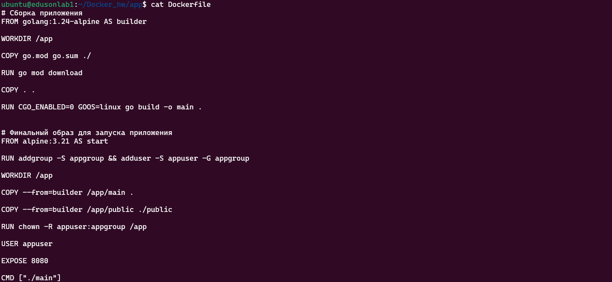

2. Добавьте **`.dockerignore`**, чтобы в контекст не попадали мусор, секреты и большие
артефакты.
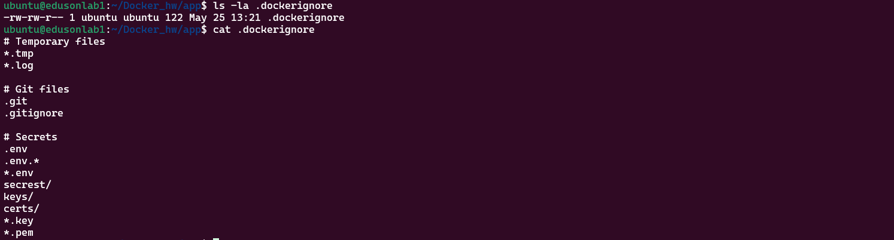

3. Зафиксируйте в отчёте **две** успешные сборки:
- обычная: `docker compose build` (или `docker build` с указанием контекста);
- принудительная без кэша: `docker compose build --no-cache` **или** `docker build --no-cache…`.
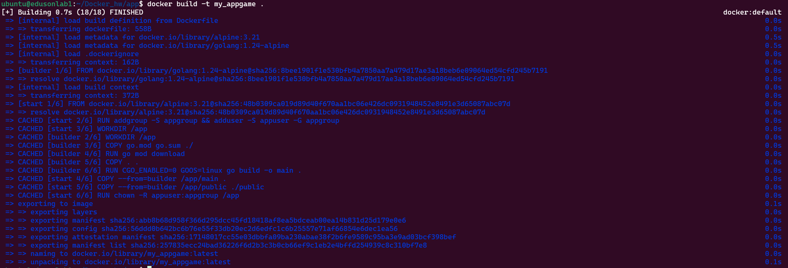

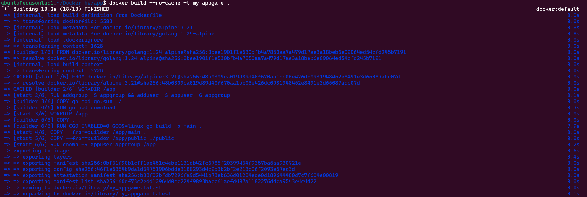

4. Укажите **размер** финального образа приложения (`docker images`) и кратко — что даёт
multi-stage по сравнению с одностадийным образом на базе SDK.

- **Multi-stage сборка позволяет уменьшить итоговый размер образа, путём передачи итоговых только необходимых артефактов.**

---
## Docker Compose как единый стек
1. Опишите сервисы в **`compose.yaml`**: **`build`**/`image`**, **`environment`**,
**`env_file`**, сети, тома, порты **только у прокси**, **`restart`** по желанию.
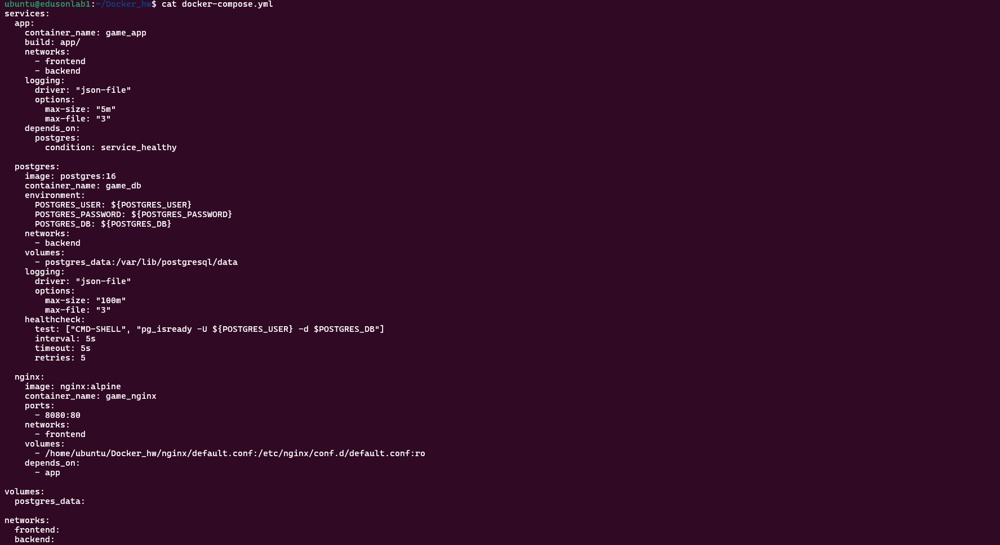
2. Поднимите стек: `docker compose up -d`, покажите `docker compose ps`.
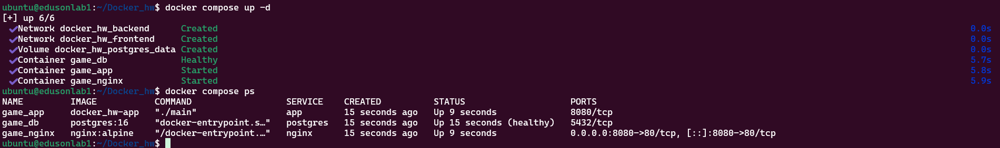
3. Продемонстрируйте **перемонтирование только одного сервиса** после правки кода или
конфига: `docker compose up -d --build <service>`.

- **До `docker compose up -d --build game_nginx`:**

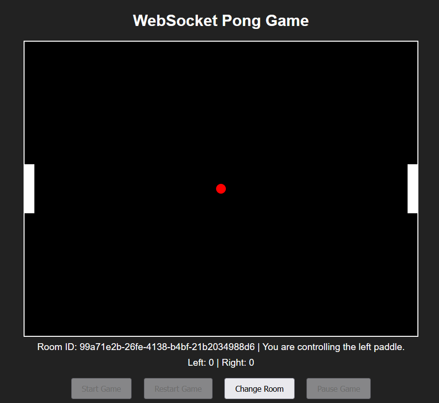

- **После `docker compose up -d --build game_nginx`:**

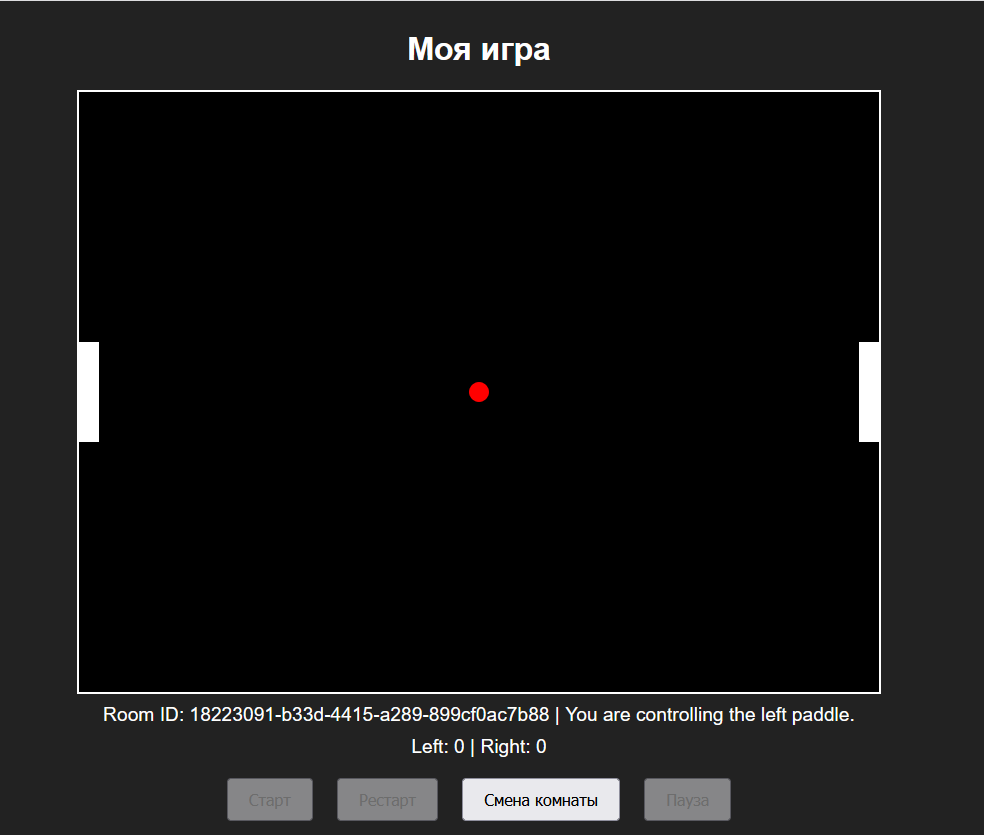

---
## наблюдаемость и эксплуатация
Выполните и приложите к отчёту вывод команд (можно обрезать длинное, но ключевые поля
видны):
1. Логи: `docker compose logs -f` (фрагмент), последние строки одного сервиса, фильтрация
по времени при необходимости.
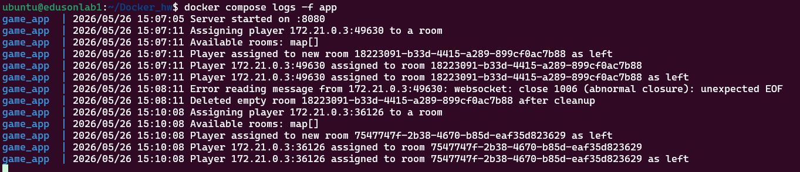

2. Инспекция: `docker inspect` для контейнера приложения — найдите и прокомментируйте
**IP в нужной сети**, маунты томов, лимиты логов (если заданы).

- **Сеть для контейнера game_app:**
Контейнер имеет две сети:  docker_hw_frontend и docker_hw_backend.
- docker_hw_frontend - 172.21.0.2 (черед данную сеть получается связь с контейнером game_nginx)
- docker_hw_backend - 172.20.0.3 (черед данную сеть получается связь с контейнером game_db)

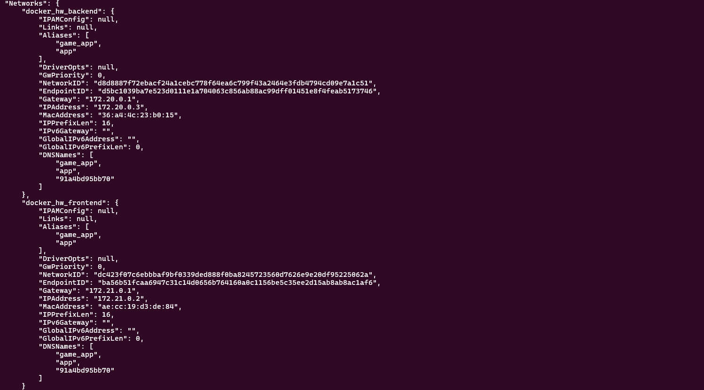

- **Настройки логирования контейнера game_app:**
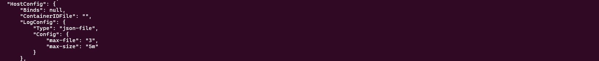

- **Монитрование для контейнера game_db(так как в game_app не было монтирования томов):**
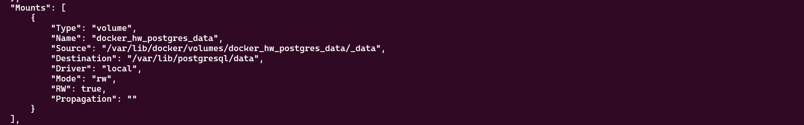

3. Ресурсы под нагрузкой: либо `docker stats`, либо **`docker compose top`**; добавьте
короткий **скрипт** или команду (`curl`, `ab`, `hey`, `k6` — неважно), симулирующую
запросы к опубликованному порту прокси.

- **Воспользовавшись скриптом с прошлых занятий получается данная нагрузка:**

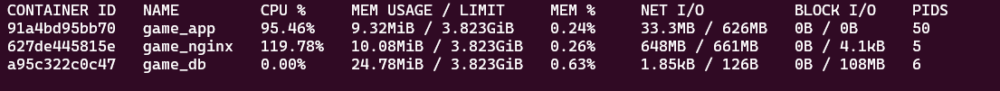

4. Убедитесь, что **ротация логов** задана в манифесте и видна в `docker inspect` (секция
`LogConfig`).
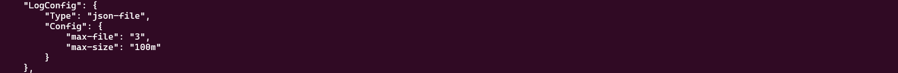

---
## тома и персистентность
1. Создайте запись в БД через приложение или `compose exec` в клиент БД.
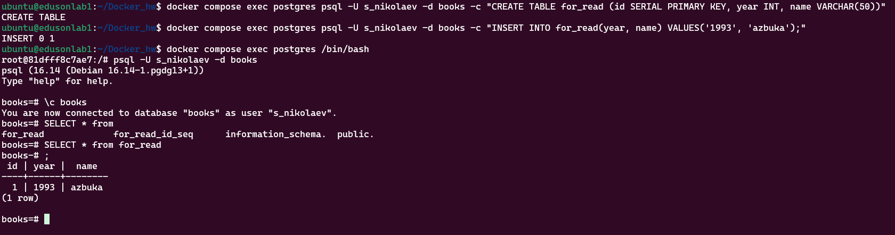
2. Выполните **`docker compose down`** (без `-v`), затем снова **`up`**: данные на месте.
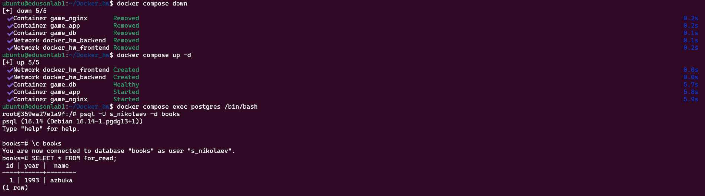
3. Выполните **`docker compose down -v`** и объясните одним абзацем, что произошло и
когда так делать **нельзя** на проде.
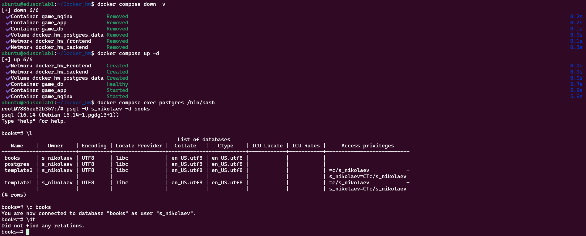

- **Команда down с добавлением аргумента -v отключает все созданные контейнеры, при этом удаляя все данные из примонтированных именнованных томов к Compose. Вообще, если нет цели обнулить данные, то на проде такую команду прописывать нельзя.**