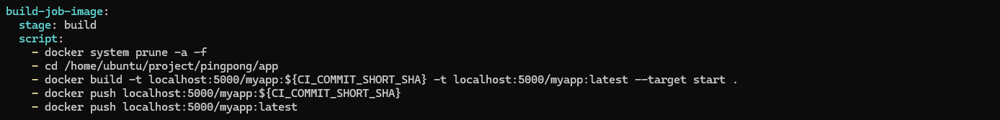
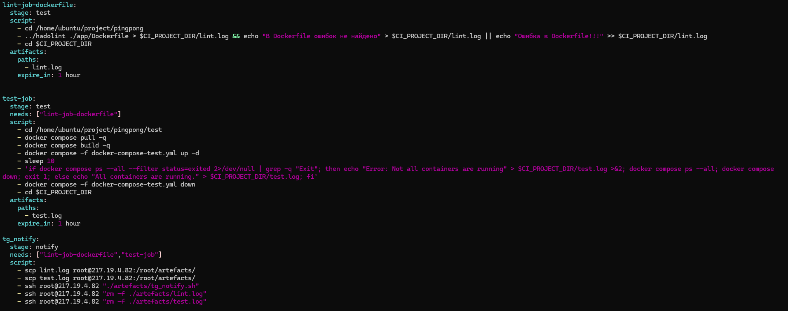
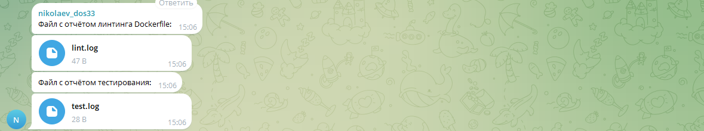
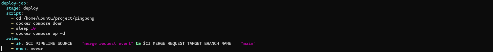
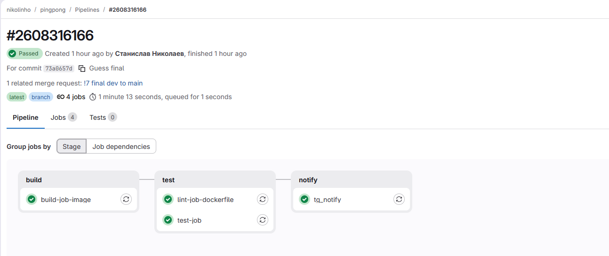
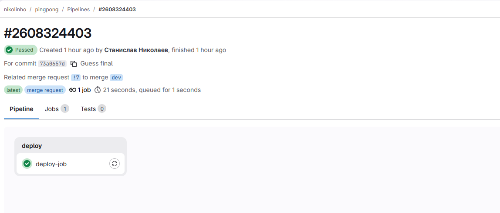

## ДЗ по ci/cd
### Ссылка на репозиторий: https://gitlab.com/nikolinho/pingpong
### Описание процесса автоматизации - при изменение проекта, написанного на go языке, происходит пересборка образа описанного в Dockerfile, с дальнейшим подставлением полученного образа в docker compose

1. Необходимо описать процесс, подлежащий автоматизации. Какой гитфлоу и инструмент будете использовать.

- Для решения данной задачи автоматизации использованы мощности на сайте gitlab, а также gitlab-runner, установленный локально на одну из виртуальных машин.
- Гитфлоу - так как не предвидится для других пользователей использование с данным репозиториям, то был предпринят github flow(две ветки main и dev)

2. При использовании мультистэйджинг сборки покажите как можно проводить все шаги только при помощи команды build.

- Мультисдейж сборка проходит в стейдже **build-job-image**, здесь собирается образ из подготовленного Dockerfile и кладётся в локальный Container Registry. Так же на этом шаге очищаются те образы, которые не используются в данный момент docker compose, что позволяет не засорить старыми образми систему.

3. Обеспечьте сохранение артефактов линтинга и тестирования, подготовьте отчет по проверкам и отправьте в канал (например тг) для информирования о прошедшем тестировании. (стэйдж notify)
- На данном этапе проходид линтинг Dockerfile, а так же тестирование docker compose на отличном порту от production, чтобы не произошли сбои. По итогу этих джоб создаются два артефакта(которые автоматом удаляются через час), которые копируются на уданные сервер средствами scp, с дальнейшей отправкой в телеграмм уведомлением и после чего удалением с удаленного сервера данных артефактов.

4. Сделайте простейший вариант деплоймента через docker compose файл, который вы будете запускать
- И на последнем стейдже выполняется deploy docker compose в production, если происходит merge request в ветку main.

Скрины последнего удачного завершения пайплайна:

