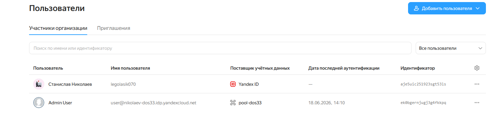
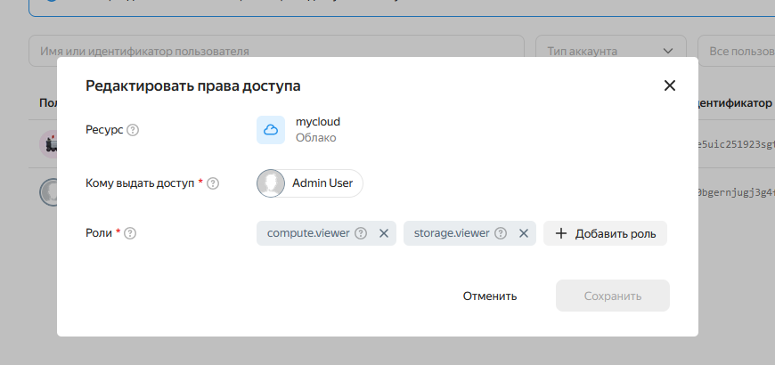
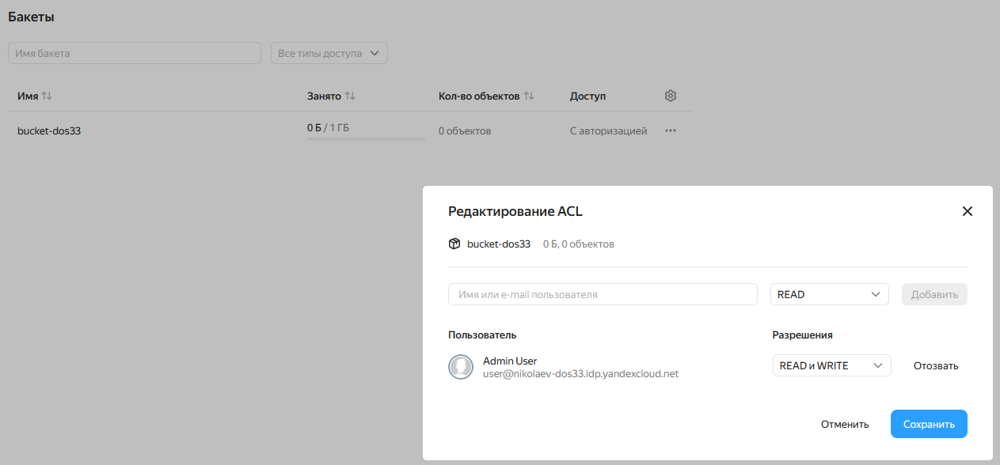
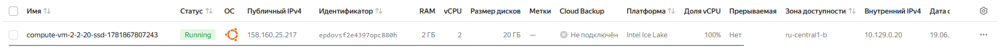
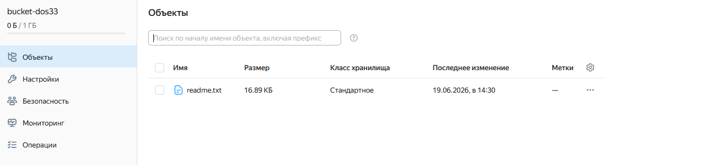
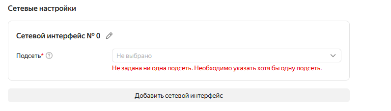
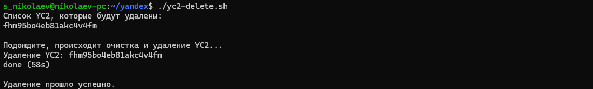
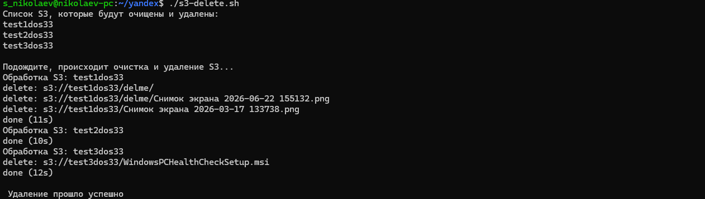

### 1. Создайте основного администратора облака и вспомогательного пользователя для текущего задания.

### 2. Наделить пользователя правми на использование конкретного бакета и просмотр списка ec2 (yc2).

- Выдал роли для просмотра `Виртуальных машин` и `S3`

- Затем выдал роль для работы уровня `чтение и запись` конекреного бакета s3.

### 3. Проверьте что пользователь для занятия может просматривать ec2 и бакеты, попробуйте создать виртуальную машину и разберите тест ошибки.
- Список ВМ под пользователем:

- Загрузка файла в бакет s3 из-под пользователя:

- Ошибка при создании ВМ. Получается, что у пользователя не хватает прав для выбора/просмотра/создания сетевого интерфейса, поэтому появляется данная ошибка. Если же дать доступ к VPC, то тогда уже будет падать с ошибкой, что у пользователя недостаточно прав для создания самой ВМ.

### 4. Создайте ec2 и дайте ей возможность работать с s3. Проверьте работу.

- Загрузка и копирование файла между созданной yc2 и s3.

### 5. Напишите скрипт очистки созданных сущностей или на bash with cli или на python.

- Удаление созданной yc2

- Удаление созданного бакета s3
