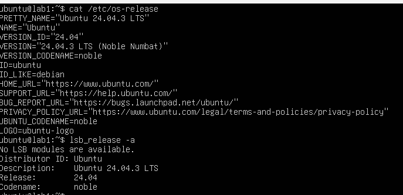

1. Выполните команды, что они выводят, как можно использовать вывод упомянутых команды

### Информация о релизе ОС
```console
    cat /etc/os-release
    lsb_release -a
```


### Информация об архитектуре процессора, а также ядре, ОС и другом оборудовании
```console
    uname -m
    uname -a
```

### Информация об оперативной памяти
```console
    free -h
    cat /proc/meminfo | grep MemTotal
```

### Информация о процессоре
```console
    lscpu
    cat /proc/cpuinfo | grep "model name"
```
