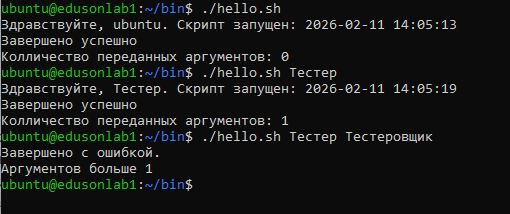
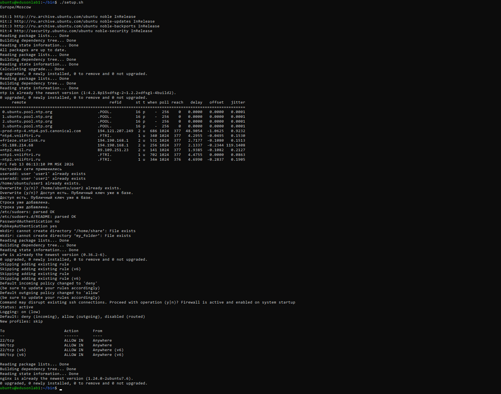

## Для начинающих


1. Напишите скрипт `~/bin/hello.sh`, который:
   - принимает один аргумент (имя пользователя);
   - если аргумент не передан — использует значение по умолчанию (например, текущего пользователя из `$USER`);
   - выводит приветствие вида: `Здравствуйте, <имя>. Скрипт запущен: <дата и время>. Количество переданных аргументов: N.`
   - в начале скрипта укажите shebang и комментарий с описанием назначения скрипта.
2. Сделайте скрипт исполняемым и запустите его: без аргументов, с одним аргументом. Приложите вывод.
3. Добавьте в скрипт проверку кода возврата последней команды (`$?`) после вывода и выведите сообщение «Завершено успешно» или «Завершено с ошибкой» в зависимости от значения.
4. Напишите скрипт настройки виртуальной машины из предыдущего задания
**Пояснение:** закрепить использование `$1`, `${1:-значение}`, `$#`, `$?`, shebang, `chmod +x`.


### Ответ

1. Скрипт №1:
```console
#!/bin/bash

### Скрипт для определния имени пользователя, текущей даты запуска скрипта и колличества переданных аргументов.

datetime=$(date +"%Y-%m-%d %H:%M:%S")

if [ "$#" = 1 ]; then
        echo "Здравствуйте, $1. Скрипт запущен: $datetime"
elif [ "$#" = 0 ]; then
        echo "Здравствуйте, $USER. Скрипт запущен: $datetime"
else
        echo -e "Завершено с ошибкой.\nАргументов больше 1, а точнее $#"
        exit 1;
fi

echo "Колличество переданных аргументов: $#"


if [ $? -eq 0 ]; then
        echo "Завершено успешно"
else
        echo "Завершено с ошибкой"
fi
```



4. Скрипт №2
```console
#!/bin/bash

# Поиск и установка зоны
timezone="$(timedatectl list-timezones | grep "Moscow")"
echo $timezone
sudo timedatectl set-timezone $timezone
echo ""
# Установка ntp и добавление pool серверов
sudo apt update && sudo apt upgrade -y #Обновление системы
sudo apt install ntp -y #Установка ntp демона
sudo sed -e '/pool 2.ubuntu.pool.ntp.org iburst/s/^#*/#/g' -i /etc/ntpsec/ntp.conf # Комментирование лишних дефолтных пулов времени
sudo sed -e '/pool 3.ubuntu.pool.ntp.org iburst/s/^#*/#/g' -i /etc/ntpsec/ntp.conf
ntpq -p # Проверка синхронизации и и вывод времени
date


# Копирование сетевого файла netplan(dhcp сеть) и применение настроек
sudo cp /home/ubuntu/bin/00-installer-config.yaml /etc/netplan/
sudo netplan apply
echo "Настройки сети применились"

# Создание пользователей
sudo useradd -m -s /bin/bash user1
sudo useradd -m -s /bin/bash user2
# Создание ключей по пути /home/ubuntu/*.pub
ssh-keygen -t ed25519 -C "user1" -q -N '' -f ~/user1 <<< $'\nn'
ssh-keygen -t ed25519 -C "user2" -q -N '' -f ~/user2 <<< $'\nn'

# Даём доступ ssh пользователя
sudo cp -r /home/ubuntu/.ssh /home/user1/
sudo cp -r /home/ubuntu/.ssh /home/user2/
sudo chown -R user1:user1 /home/user1/.ssh
sudo chown -R user1:user1 /home/user2/.ssh

USER1_PUBKEY=$( cat /home/ubuntu/user1.pub ) # Задаем переменные со значением публичных ключей, чтобы проверить нет ли их уже с дальнейшим добавлением
USER2_PUBKEY=$( cat /home/ubuntu/user2.pub ) # в /home/ubuntu/.ssh/authorized_keys
AUTH_FILE1="/home/user1/.ssh/authorized_keys"
AUTH_FILE2="/home/user2/.ssh/authorized_keys"

### Добавление в файл с проверкой уже наличия публичного ключа в базе
if sudo grep -q "$USER1_PUBKEY" "$AUTH_FILE1"
then
        echo "Доступ есть. Публичный ключ уже в базе."
else
        echo $USER1_PUBKEY | sudo tee -a $AUTH_FILE1
fi

if sudo grep -q "$USER2_PUBKEY" "$AUTH_FILE2"
then
        echo "Доступ есть. Публичный ключ уже в базе."
else
        echo $USER2_PUBKEY | sudo tee -a $AUTH_FILE2
fi

# Даем доступ группе user1 - 'apt update', а пользователю user2 использовать 'systemctl status' без пароля
USER1_update="%user1 ALL=(ALL) NOPASSWD: /usr/bin/apt update"
USER2_status="user2 ALL=(ALL) NOPASSWD: /usr/bin/systemctl status *"
SUDOERS="/etc/sudoers"

sudo chmod +w /etc/sudoers

if sudo grep -q "$USER1_update" "$SUDOERS"
then
                echo "Строка уже добавлена."
        else
                        echo "$USER1_update" | sudo tee -a $SUDOERS
fi


if sudo grep -q "$USER2_status" "$SUDOERS"
then
                echo "Строка уже добавлена."
        else
                        echo "$USER2_status" | sudo tee -a $SUDOERS
fi

sudo chmod -w /etc/sudoers
sudo visudo -c

# Установка захода только по ключам
sudo truncate -s 0 /etc/ssh/sshd_config.d/50-cloud-init.conf # Очистка файла от всех записей
echo -e "PasswordAuthentication no\nPubkeyAuthentication yes" | sudo tee -a /etc/ssh/sshd_config.d/50-cloud-init.conf # Установка запретов
sudo systemctl restart ssh

# Создаем папку и даем права наследования
sudo mkdir /home/share
sudo chmod -R g+s /home/share
sudo chmod 777 /home/share
cd /home/share
mkdir my_folder
chmod 700 /home/share/my_folder


# Настройка доступа к портам и проверка правил + nginx
sudo apt install ufw -y
sudo ufw allow 22/tcp
sudo ufw allow 80/tcp
sudo ufw default deny incoming
sudo ufw default allow outgoing
yes | sudo ufw enable
sudo ufw status verbose
sudo apt install nginx -y
```
